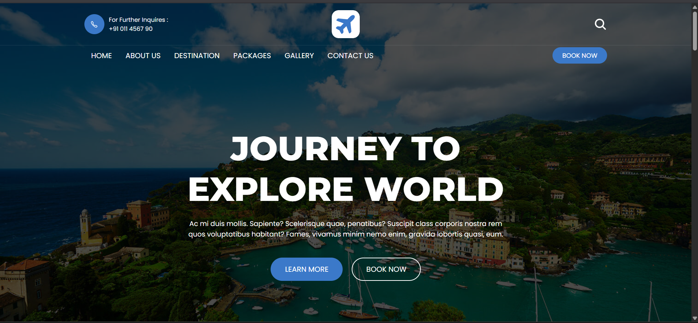
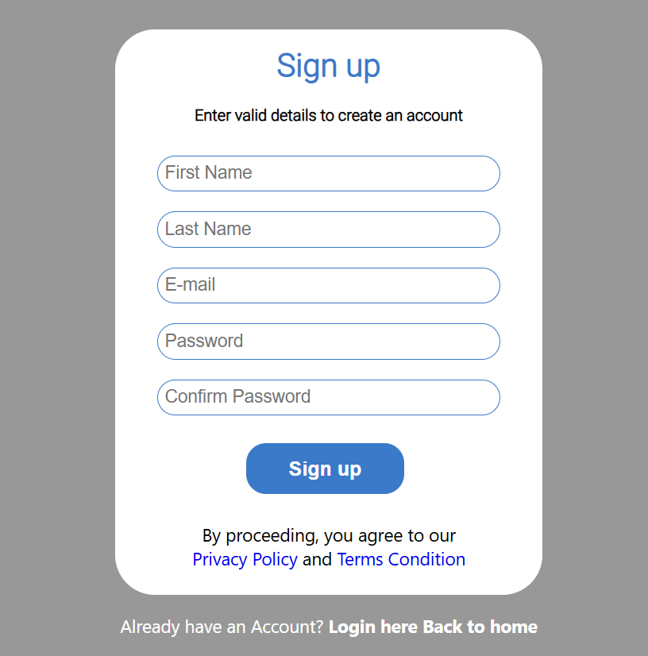

# Wanderlust: A Static Travel Website

Wanderlust is a static travel and tourism website template. It allows users to browse different destinations and features a clean, responsive design. The project uses **HTML, CSS, and JavaScript** for the front end, with **Firebase** integrated for user authentication. Login and SignUp functionality integrated to store realtime data of user credentials on firebase.
Navigation for Sign Up:-

After clicking on Book Now you can register yourself


Try here: 
https://anikr47.github.io/Wanderlust/


## ✨ Features

-   **User Authentication:** Secure user sign-up and login functionality powered by Google Firebase.
    
-   **Static Content:** A beautifully designed, static interface for showcasing travel destinations.
    
-   **Responsive Design:** The user interface is built with Bootstrap for a seamless experience on all devices, from mobile to desktop.
    
-   **Clean Codebase:** The project is built with clean and easy-to-understand HTML, CSS, and vanilla JavaScript.
    

## 🛠️ Technologies Used

-   **Frontend:** HTML5, CSS3, JavaScript
    
-   **Authentication:** Firebase Authentication
    
-   **Styling:** Bootstrap
    

## 📂 How to Use

To run this project locally, follow these simple steps:

1.  **Clone the repository:**
    
    ```
    git clone https://github.com/Anikr47/Wanderlust.git
    
    ```
    
2.  **Navigate to the project directory:**
    
    ```
    cd Wanderlust
    
    ```
    
3.  **Set up your Firebase configuration:** You will need to create a Firebase project to get your own configuration keys.
    
    -   Go to the [Firebase Console](https://console.firebase.google.com/ "null") and create a new project.
        
    -   Add a new Web App to your project.
        
    -   Firebase will provide you with a configuration object. You'll need to add this to your project's JavaScript code where Firebase is initialized.
        
4.  **Open the `index.html` file in your browser:** You can do this by simply double-clicking the file or by right-clicking and selecting "Open with" your preferred browser.
    

## 🤝 Contributing

Contributions are welcome! If you find any bugs or have suggestions for improvements, please feel free to open an issue or create a pull request.

1.  Fork the Project
    
2.  Create your Feature Branch (`git checkout -b feature/AmazingFeature`)
    
3.  Commit your Changes (`git commit -m 'Add some AmazingFeature'`)
    
4.  Push to the Branch (`git push origin feature/AmazingFeature`)
    
5.  Open a Pull Request